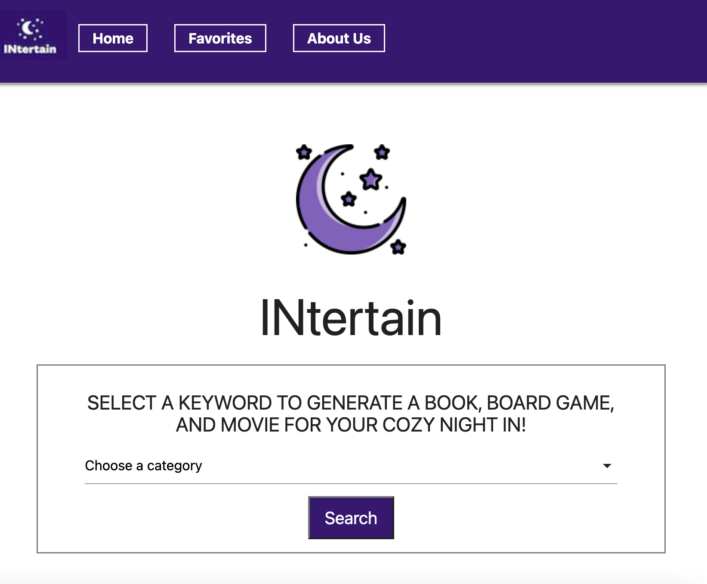

# Intertain

## Introduction

Don't know what to do for your night in? Once a user selects a genre, three web APIs work together to generate entertainment options in the form of a book, movie, and board game. Favorite your results or refresh until satisfied! Find some Intertainment [here](https://nw-bootcamp-team1.github.io/Night-In/home-page/index).

## Table of Contents
- [Intertain](#intertain)
  - [Introduction](#introduction)
  - [Table of Contents](#table-of-contents)
  - [Goals](#goals)
  - [Results](#results)
  - [Badges](#badges)
  - [Features](#features)

## Goals

The project should fulfill the following requirements:
+Provide users with a fun and engaging way to spend their night in.
+Offer a variety of entertainment options in the form of a book, movie, and board game.
+Allow users to select their preferred genre to ensure personalized results.
+Utilize three web APIs to gather and generate options based on the user's selected genre.
+Provide users with the ability to favorite their results for future reference.
+Allow users to refresh their results until they are satisfied with their options.

## Results

By utilizing agile development practices, our group was able to deliver a functional and elegant project, despite the challenge of a tight deadline. Specifically, we were able to:
+ Efficiently manage our project through agile methodologies.
+ Develop a sleek and user-friendly design that enhanced the overall user experience.
+ Collaborate effectively as a team to leverage knowledge and resources, communicate progress and updates, and provide constructive feedback.
+ Adapt to shifting requirements and priorities as needed throughout the project's lifecycle.
+ Deliver the final product on time and within the specified constraints.

## Badges

## Features

+ Open Library API
+ Board Game Atlas API
+ TMDb API